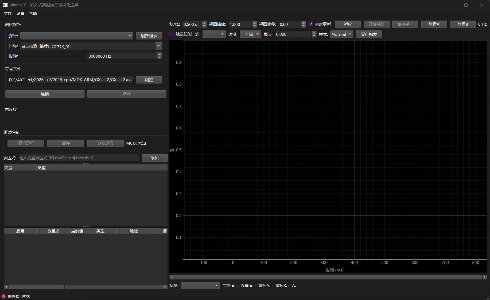
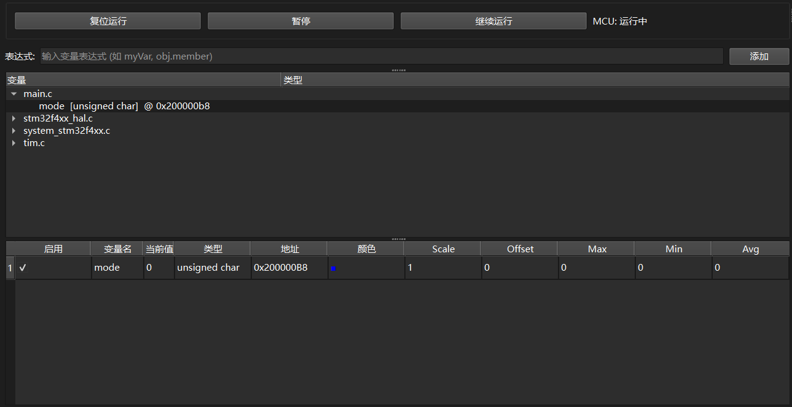
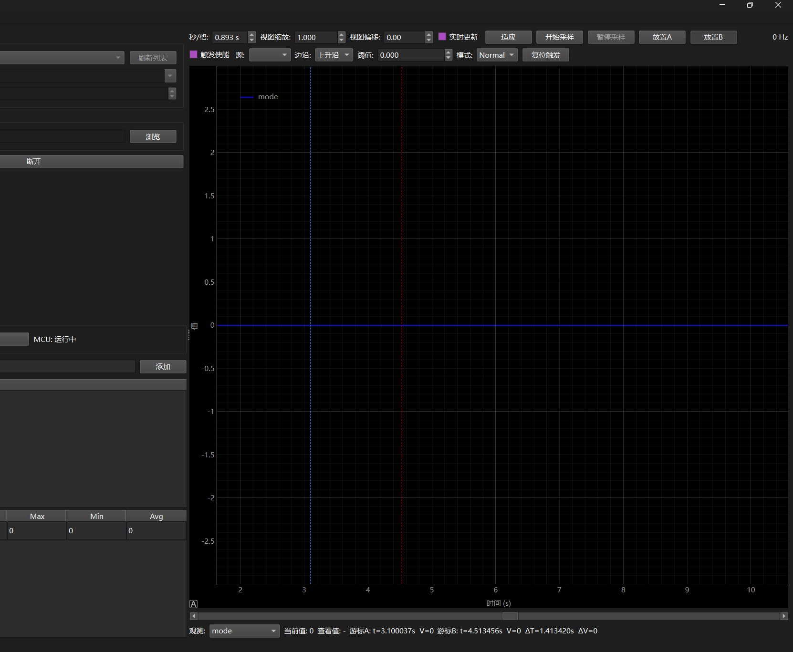

# 使用教程
```bash
#建议使用venv创建独立的Python环境
python -m venv venv
venv\Scripts\activate        # Windows
# source venv/bin/activate   # Linux/macOS

# 安装依赖
pip install -r requirements.txt

#运行
python -m src.main
```

## 使用教程

1. **配置调试探针**: 点击 `[刷新列表]` 按钮，扫描当前连接的调试器.
2. **选择调试目标**: 从`[目标]`下拉菜单选择目标调试型号, 推荐直接使用 `cortex-m` .
3. **加载 ELF&AXF 文件**: 在`[符号文件]`栏点击`[浏览]`按钮，选择编译生成的 `.axf` / `.elf` 文件.
4. **连接**: 点击`[连接]`按钮，程序解析 ELF 文件中的全局变量符号，并连接调试器和目标芯片.


5. **添加变量**: 在左侧的变量树中，双击或右键添加需要监控的变量到 `监控列表` .
6. **设置显示比例**: 监控表中每个通道可独立设置 `Scale` (乘法因子)和 `Offset` (加法偏移),以适配不同单位和范围的变量.
7. **运行与暂停**: 单击 `[复位运行]` 按钮，可以复位目标芯片并开始运行; 单击 `[暂停]` 和 `[继续运行]` 按钮可以控制目标芯片的运行状态.


8. **开始采样与暂停** 单击 `[开始采样]` 按钮，程序开始从目标芯片读取变量值并实时绘制波形; 点击 `[暂停采样]` 可以暂停数据更新和波形绘制.
9. **分析工具**:   
- **坐标系缩放**: `[秒/格]` 和 `[试图缩放]` 标签可以通过鼠标滚轮调整时间轴和数值轴的缩放比例; `[适应]` 为 `AutoScale` 功能, 自动调整坐标轴范围以适应当前波形数据.
- **游标工具**: `放置A` 和 `放置B` 按钮可以在波形图上放置两个垂直游标, 用于测量时间间隔和数值差异; 底部 `[观测]` 下拉列表可以切换游标观测的变量.
- **软件边沿触发器**: `[触发源]` 可从变量观测列表中选择一个变量作为触发源;   
`[边沿]` 可设置 `上升沿` or `下降沿` 触发, `[阈值]` 可设置触发阈值;  
启用触发后, 波形将以触发事件为基准进行对齐显示, 方便分析特定事件前后的波形变化;  
`[模式]` 可设置触发模式为 `single` or `Normal`;  
`[复位触发]` 按钮可清除当前触发状态, 重新等待下一个触发事件.

10. **采样频率设置**: `[设置]` -> `[采样频率]` 可以设置数据采样的频率, 以适应不同应用场景的需求.
11. **CSV数据导出**: 
- `[设置]` -> `[设置CSV导出路径]`可以设置CSV数据的导出路径.
- `[文件]` -> `[导出CSV]` 按钮，将波形数据导出为 CSV 文件，支持已采样的数据; 导出的数据为 `.csv` 格式.
- **数据示例**:  

| timestamp_ns | time_s | var1 | var2 |
|------|--------------|------------|------------|
| 5981962713900 | 0.1 | 1 | 2 |
| 5981966644600 | 0.13 | 3 | 4 |
| 5981966644600 | 0.15 | 77 | 78 |